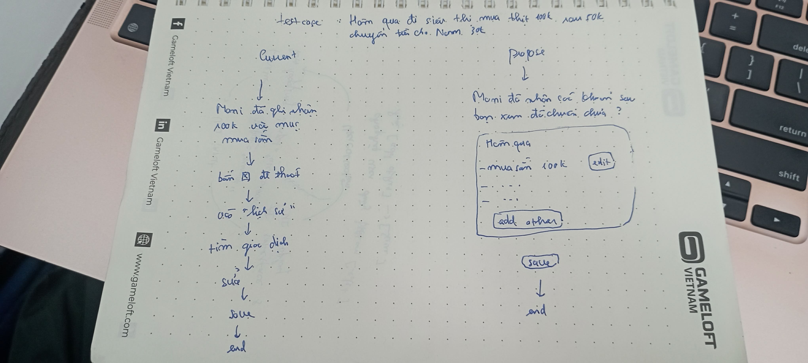

# UX exercise - MoMo Moni AI

## Sản phẩm: MoMo - Trợ thủ AI Moni (phân loại chi tiêu)

## 4 paths

### 1. Khi AI đúng
- User nhập lệnh dài gồm nhiều món đồ (ví dụ: đồ ăn + di chuyển + mua sắm nhỏ).
- Hệ thống không chỉ trả về 1 dòng text, mà tách ra thành các thẻ (cards): Số tiền - Tên mục - Danh mục để phân loại.
- Hệ thống tự động tính tổng tiền để user đối chiếu nhanh, giảm sai sót trước khi xác nhận.
- Đánh giá: Path này xử lý khá tốt vì UI giúp user cross-check trực quan.

### 2. Khi AI không chắc (giả định)
- Nếu user nhập mơ hồ như "hôm nay tiêu nhiều quá", hệ thống không tự suy đoán.
- AI chủ động hỏi tiếp bằng câu hỏi gợi ý để làm rõ dữ liệu, ví dụ:
  "Bạn đã chi những khoản nào, hãy kể chi tiết để Moni ghi chép giúp nhé?"
- Đánh giá: Có cơ chế fallback bằng prompt hỏi lại, tránh gán nhãn sai khi thiếu thông tin.

### 3. Khi AI sai / Lỗi
- Case thử nghiệm: nhập giao dịch 5 tỷ.
- Hệ thống báo lỗi trực tiếp: vượt giới hạn 1 tỷ/giao dịch, yêu cầu user tự chia nhỏ giao dịch.
- Điểm dương: Lỗi được thông báo rõ ràng, user hiểu nguyên nhân ngay.
- Điểm trừ UX: Recovery flow còn mệt mỏi vì khung chat một dòng, đoạn text dài dễ bị khuất, user khó edit lại prompt cũ.
- Đánh giá: Có báo lỗi nhưng trải nghiệm sửa lỗi chưa tối ưu.

### 4. Khi user mất niềm tin (giả định)
- Tình huống: user thất vọng vì AI không vẽ được biểu đồ/không trả về kết quả mong đợi.
- Hệ thống không có nút tắt để nhảy nhanh sang màn hình "Thống kê" truyền thống.
- User phải tự quay lại màn hình chính và tìm bằng tay để xem chart.
- Đánh giá: Exit/fallback tồn tại nhưng khó tìm, không được thiết kế rõ ràng trong context thất bại của AI.

## Path yếu nhất: Path 3 + 4
- Path 3 yếu ở chỗ sửa lỗi: biết lỗi nhưng thao tác khó, tốn công sửa prompt.
- Path 4 yếu ở chỗ fallback: không có luồng "thoát AI" rõ ràng ngay tại điểm user mất niềm tin.
- Hai path này kết hợp làm user dễ bỏ cuộc hoặc bỏ qua tính năng AI.

## Gap marketing vs thực tế
- Marketing kỳ vọng: AI trợ lý tài chính thông minh, nhập là hiểu, giảm công ghi chép.
- Trải nghiệm thực tế: AI hoạt động tốt trong case rõ ràng, nhưng với input mơ hồ hoặc lỗi biên thì giới hạn UX lộ ra rất rõ.
- Gap lớn nhất:
  - Marketing nhấn mạnh sự "thông minh, tiện lợi".
  - Sản phẩm chưa truyền tải rõ "nếu AI sai thì sửa nhanh thế nào" và "nếu không tin AI thì thoát sang chế độ thủ công ở đâu".

## Sketch

- As-is: User nhập giao dịch -> AI phân loại/phản hồi -> nếu sai thì user sửa thủ công trong chat hoặc quay lại màn hình thống kê.
- To-be:
  - Nếu confidence thấp: hiện quick question để hỏi tiếp ngay trong luồng chat.
  - Nếu AI sai: thêm nút "Sửa nhanh" (inline edit) thay vì bắt user gõ lại cả câu.
  - Nếu user mất tin: thêm nút "Chuyển sang thống kê thủ công" ngay tại màn hình chat.
  - Hiện thông báo "Đã ghi nhận chỉnh sửa" để tạo cảm giác AI có học từ feedback.

## Tổng kết
- Điểm mạnh: Path 1 (hiển thị card + tổng tiền để confirm).
- Điểm cần cải thiện gấp: Path 3 và Path 4 (recovery flow và fallback flow).
- Ưu tiên đề xuất: thiết kế rõ "AI thất bại thì user đi đâu" và "sửa sai trong 1-2 thao tác".
